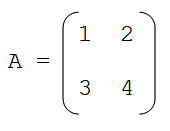

```{r setup, include=FALSE}
knitr::opts_chunk$set(echo = TRUE)
```

## 1. Numeric Vectors
### A

```{r 1A}
# arctan of the reciprocal of all integers from 1 to 1000 
arctan <- atan(1/(a <- 1:1000))
str(arctan)
```

### B

```{r 1B}
# create vectors x, y, and z using reciprocals and tangents
z <- 1/(tan(y <- atan(1/(x <- 1:1000))))
str(z)
```

### C

```{r 1C}
# compare variables x and z
str(x == z)
identical(x, z)
all.equal(x, z, tolerance = 0)
```
While the '==' operator and the identical() function test for exact equality, the all.equal() function usually tests for near equality, by automatically setting a tolerance level beyond which it no longer considers the difference in the two values. 

When we set the tolerance level to 0, the all.equal() function returns the difference between the two vectors, since they are not perfectly equal to each other due to rounding errors from the arctan function. The mean relative difference indicates that on average, the rounding error is 1.67739e-16, which is very small.  


## 2. Character and Logical Vectors
### A

```{r 2A}
character <- c("alpha", "bravo", "charlie", "delta", "echo")
character
```

### B

```{r 2B}
character[4]
```

### C

b is a logical vector, with values (T, T, F), meaning (TRUE, TRUE, FALSE). When we run the line b + 3, the logical vector is promoted into a numeric vector as (1, 1, 0), so we can numerically add 3 to it to get (4, 4, 3). 

However, d consists of a character vector (a) and a logical vector (b), and since all data in an atomic matrix or vector must be of the same type, the values in b must be coerced into the character type. d is now a character matrix. Thus, d[,2] + 3 does not work because we are trying to add vectors of the character type and numeric type together, and that doesn't make sense. 


## 3. Matrices
### A

```{r 3A}
v <- matrix(1:300, nrow = 100, ncol = 3)
```

### B

```{r 3B}
v[,2]
```

### C

```{r 3C}
v[seq(1, 100, 2),]
```

### D

```{r 3D}
library(matrixcalc)
help(matrix.inverse)
```

I searched online and found that we can install the matrixcalc package, which has a function called matrix.inverse() that according to the help description, "returns the inverse of a square matrix computed using the R function solve."

Based on this description, I realized that I could have also used the solve() function to find the inverse of a square matrix containing the coefficients of the linear system.

### E

Using the matrix 
{width=1.5in}

The inverse of A can be calculated using the matrix.inverse() function by:
```{r}
example <- matrix(c(1, 2, 3, 4), nrow = 2, ncol = 2)
example
matrix.inverse(example)
```
To verify, we can use R as a calculator to compute the inverse of A. We manually use R to find the determinant, divide the matrix by its determinant, and interchange the necessary elements of the matrix. 
```{r}
det = (example[1,1]*example[2,2]) - (example[1,2]*example[2,1])
elements <- (1/det)*c(example[2,2], -example[2,1], -example[1,2], example[1,1])
newexample = matrix(elements, nrow = 2, ncol = 2)
newexample
```
Thus, we verify the correctness of the matrix.inverse() function.

## 4. Applications
### A

It would be a bad idea to create objects named T and F because they represent the logical values TRUE and FALSE. Thus, it would be too confusing to determine what the meaning of T and F are in the context of the situation, if we named objects T and F and also used them as logical values. 

### B

When R attempts to compute the log of -1, 0, and Inf, we get NaN, -Inf, and Inf, respectively as the outputs. To make sense of this, we must visualize the graph, domain, and limits of y=log(x). 

The domain of log(x) is for x>0, so it's undefined for x=-1, and thus, R outputs NaN.  
As x→0, log(x)→−∞, so when x=0, R outputs -Inf or negative infinity. 
As x→∞, log(x)→∞, so when x=Inf, R outputs Inf or infinity. 

### C

```{r}
tone2 <- c(8, -1, 0, 1, 6, 7, 5, 3, 0, 9, Inf)
log(tone2>0)
```
The student's code doesn't work because tone2>0 creates a logical vector that is then promoted into a numeric vector, with the values of 1 and 0 corresponding to whether or not the original values of tone2 are greater than zero. These 1s and 0s are then put through the log() function in R, so the actual values in the vector tone2 aren't actually calculated. 

The following solution should work by using indexing and eliminating any non-finite results, keeping in mind that although Inf>0, it gives FALSE to is.finite(). 
```{r}
log(tone2[tone2 > 0 & is.finite(tone2)])
```


### D

```{r 4D}
# wins consists of 8 ways to win at tic-tac-toe
tictactoe <- matrix(1:9, nrow = 3, ncol = 3, byrow = TRUE)
wins <- list(tictactoe[1,], tictactoe[2,], tictactoe[3,], tictactoe[,1], tictactoe[,2], tictactoe[,3], c(1,5,9), c(3,5,7))
wins
```
